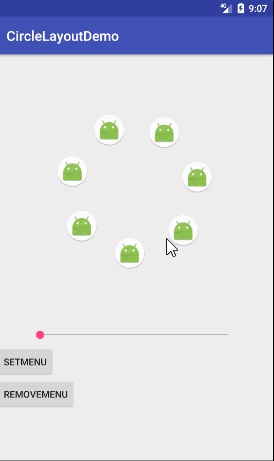

# CircleLayout
环形布局，可拖动，独立item设置，可设置中心view

#效果图



#用法

##引入
```gradle
    compile 'com.nelson:CircleLayout:0.1.0'
```
##方法
1.可以直接在布局文件中进行布局，类似LinearLayout，但是这里不需要关心布局方式，会自动将布局中的所有子view均匀分布到中心点四周，这里你可以设置自己想要的半径
```xml
<com.nelson.circlelayout.CircleLayout
        android:id="@+id/circle"
        android:layout_width="wrap_content"
        android:layout_height="400dp"
        android:layout_gravity="center"
        app:radium="120dp"
        >

        <ImageView
            android:id="@+id/image1"
            android:layout_width="wrap_content"
            android:layout_height="wrap_content"
            android:src="@mipmap/ic_launcher_round" />

        <ImageView
            android:layout_width="wrap_content"
            android:layout_height="wrap_content"
            android:src="@mipmap/ic_launcher_round" />

         ...

    </com.nelson.circlelayout.CircleLayout>

```
2.也可以直接从代码中添加子View
```java
    CircleLayout circleLayout = (CircleLayout) findViewById(R.id.circle);
    circleLayout.addView(View v);
```
3.还可以设置中心的View，这个功能目前只能在代码中设置：
```java
    circleLayout.setCenterView(View v);
```
4.当然，这里还有`remove`和`get`方法，方便使用
5.如果想在代码中动态设置半径，可以直接调用
```java
    circleLayout.setRadius(int radius);
```
6.可以控制该layout是否可滑动
```java
    circleLayout.setCanScroll(boolean isCanScroll);
```
7.如果想给每一个子view添加动画啥的，可以直接对子view进行操作
8.更多用法请自行脑补


